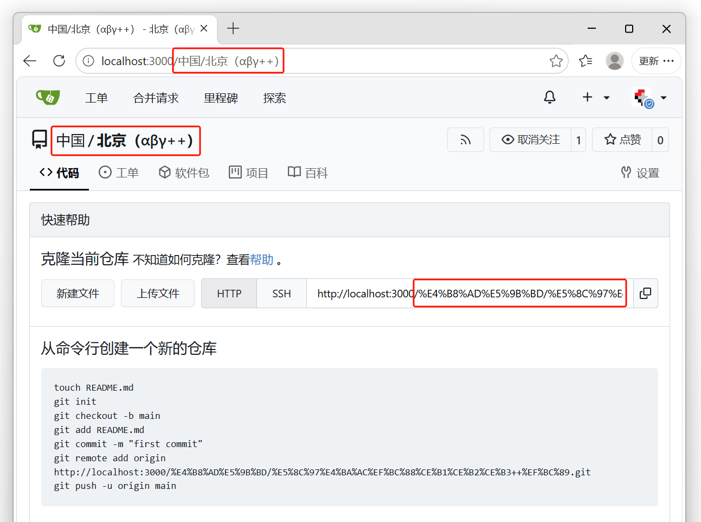

# Gitea（支持中文用户名/仓库名/组织名/团队名/徽章名）

有些时候项目名称不适合翻译成英文，但是官方Gitea拒绝了这个提案（ [#13943](https://github.com/go-gitea/gitea/issues/13943) ），所以我fork了仓库，移除了所有关于命名合法性校验的代码，以实现支持任意字符路径：



当输入中文名称时，会自动转义为URL编码（例如 **"北京"** -> **"%E5%8C%97%E4%BA%AC"**），这在网页前端、浏览器地址输入栏、和gitea本地存储仓库备份，都以中文路径呈现，方便检索和增加可读性。

注意！这可能会导致gitea存在跨平台问题、可能产生意想不到的错误（例如包含\*\\/字符）。所以，仓库命名的正确性应由使用者负责，请勿进行边界测试！

但目前可以确定的是，在Windows上可以支持GB2312中文、中文标点符号、希腊字母、以及更多ASCII字符，我想这已经提高了足够的易用性。


## 下载Windows可执行程序

从gitea-1.20.6版本以后gitea已不支持Win7（ [#29586](https://github.com/go-gitea/gitea/issues/29586) ），所以我基于两个版本进行修改，一个是基于最后支持Win7的v1.20.6版本，一个是目前的最新版v1.26.1：

支持Win7的最后版本: https://github.com/znsoooo/gitea-support-chinese-repo-name/releases/tag/win7-support-unicode

最新版本: https://github.com/znsoooo/gitea-support-chinese-repo-name/releases/latest

没有支持Linux的二进制发布版，如果需要请自行编译代码。或者有人愿意提交贡献我可以添加到下载链接中。


## 从源代码编译

编译方法（和官方推荐编译参数一致）：

```bash
# 下载代码
git clone https://github.com/znsoooo/gitea-support-chinese-repo-name
cd gitea-support-chinese-repo-name
git checkout v1.26-support-unicode

# 编译前端
pnpm install --frozen-lockfile
pnpm exec vite build

# 编译后端
$env:GOPROXY = "https://goproxy.cn,direct"                        # 设置国内代理
$env:CGO_ENABLED = "1"                                   # 应用SQLite3的必要设置
go generate -tags 'bindata sqlite sqlite_unlock_notify' ./... # 构建二进制资源包
go build -v -tags 'bindata sqlite sqlite_unlock_notify' -o gitea.exe  # 输出文件

# 启动程序
.\gitea.exe
```

如果要编译其他版本，可以克隆官方仓库，然后应用本仓库的补丁修改：

```bash
# 克隆官方仓库
git clone https://github.com/go-gitea/gitea
cd gitea

# 应用补丁修改
git checkout v1.26.1  # 检出你需要的分支
git remote add support-unicode https://github.com/znsoooo/gitea-support-chinese-repo-name
git fetch support-unicode
git cherry-pick c0b45f42540d28857f8fcc3c506942d6a7af169a

# 编译代码
# ...
```


## Bug反馈

如果存在使用问题可在issue区讨论：

https://github.com/znsoooo/gitea-support-chinese-repo-name/issues


## 原始文档

原中文README文档：[README.zh-cn.md](old/README.zh-cn.md)

原英文README文档：[README.md](old/README.md)
